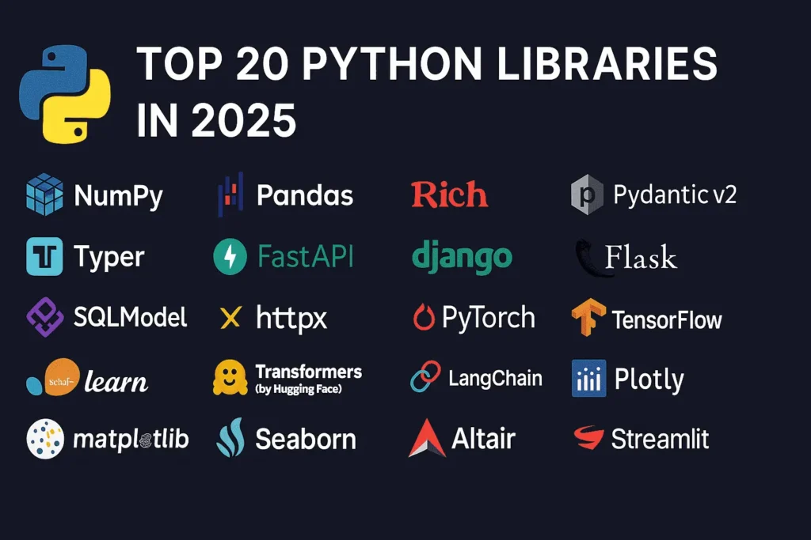
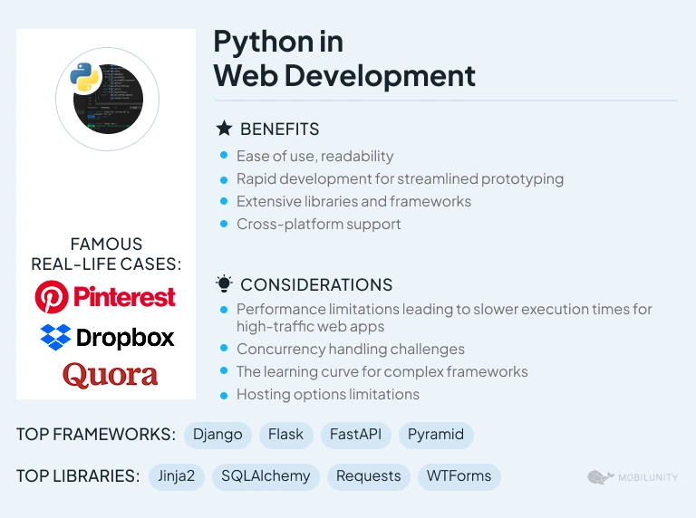
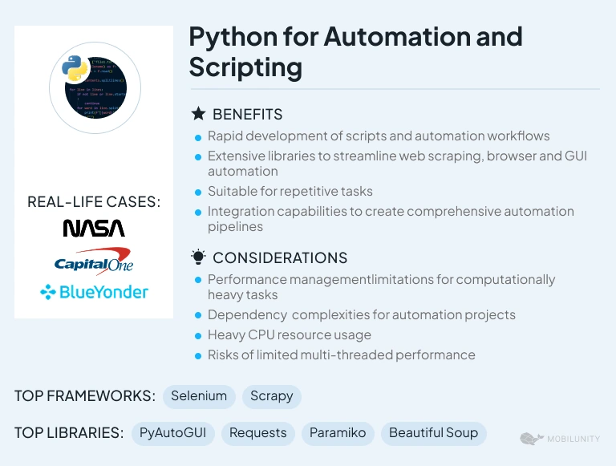
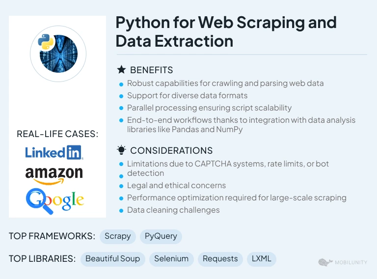
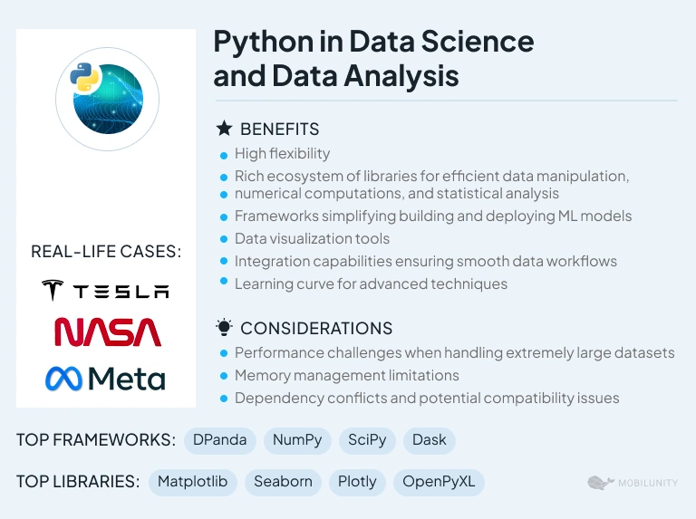
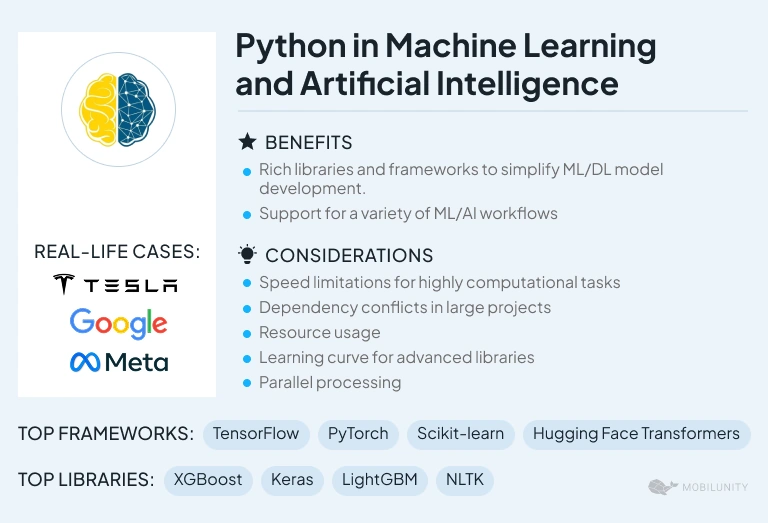
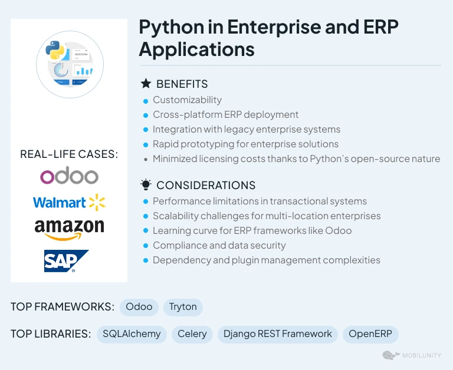

# Full Stack Python
<h1>What is full stack development?</h1>

Full stack development is the process of developing both the frontend and backend of applications. Any application has a frontend (user-facing) component and a backend (database and logic) component. The frontend contains the user interface and code related to user interactions with the application. The backend contains all the code required for the application to run, including integrations with data systems, communicating with other applications, and processing data. - AWS

<h2>Python Checklist</h2>

(1) Scripting (Python Fundamental)

(2) Data (Relational databases, ORM, NoSQL, Data Analysis, Data Viz)

(3) Web Development (Framework, Engines, Design, Task Queue, SSG, Testing, Networking, APIs, Security)

(4) Web App Deployment (Hosting, VPS, PaaS, OS, Servers, CI, CM, Containers, Architectures)

(5) DevOps (Monitoring, Performance)

(7) AI (LLM, RAG, MCP, Agents)

Image source: Internet

<h2>Business Applications Example</h2>

<b>Python is also used to build ERP and e-commerce systems:</b>

(1) Odoo is an all-in-one management software that offers a range of business applications that form a complete suite of enterprise management applications.

Source: python.org

<h2>Enterprise Example</h2>
<h3>Government agencies</h3>

<b>Python is widely used across large enterprise organizations but the code is often not put out as open source.</b>

(1) Python usage in government agencies is widespread despite the reputation of agencies as stodgy late technology adopters. Organizations range from financial industry regulators like the SEC and CFPB, to intelligence agencies like the CIA, FBI and NSA.

(2) NASA uses Python extensively and open sources much of their software.

<h3>Large tech companies</h3>

<b>Large technology companies tend to be polyglot (use many programming languages rather than standardizing on one), with Python either as a primary language or the "glue" that helps all the other languages fit together.</b>

(1) Uber's tech stack contains a significant amount of Python, which they documented in a series of engineering posts. Part one describes the lower backend levels, which are written in Python, with Node.js, Go and Java mixed in. Part two explains the higher levels of the marketplace and user interfaces.

(2) Twilio uses Python with Django and the Wagtail content management system to power the amazing Twilio documentation as well as TwilioQuest. They wrote a post about how TwilioQuest was built that goes into detail on the code including the usage of the front-end Vue.js framework. Twilio also uses Flask to run the REST API endpoints and open sourced the Flask-RESTful framework so other developers could cut down the boilerplate in their web APIs.

(3) Netflix uses Python throughout their organization to run chaos engineering tests and generally glue together the code from their high-functioning polyglot teams. Netflix also wrote a 2019 update for PyCon US to give more detail on what teams and projects work in Python.

(4) Python 3 at Mozilla explains how their "build system, CI configuration, test harnesses, command line tooling and countless other scripts, tools or Github projects are all handled by Python". So just about everything a developer touches every day to build anything else needs Python to hook into the larger organization!

(5) Google uses Python extensively and officially supports it internally as one of their three core languages, the other two being Java and Golang. While Google likely has every programming language running somewhere in their infrastructure, Python receives priority support due to its core language status.

(6) Dropbox is well-known for using Python across their application development, infrastructure and operations. They also did a good job of cornering the market on hiring well-known Python core contributors for a period of time, such as Guido van Rossum and Jessica McKellar (although Jessica is now at a new company that she co-founded).

 (7) Facebook (Meta) and Instagram use Python 3 at scale. They've been very vocal about successfully making the migration from the Python 2 world into Python 3.

 (8) A significant portion of Reddit is built in Python and it is one of the largest sites at scale to use the programming language.

<b>"Many companies do not even realize they are using Python across their organizations. For example, if a company is a "Java-only shop" but they use IBM WebSphere as a web application server then they have to use Python to script the server's configuration! Python has a habit of getting in everywhere regardless of whether the usage is intentional."</b>

Source: Matt Makai

<h2>7 Years of YouTube Scalability</h2>

Python - most of the lines of code for YouTube are still in Python. Everytime you watch a
YouTube video you are executing a bunch of Python code.

<b>A lot of YouTube systems start as one Python file and become large ecosystems after
many many years. All their prototype were written in Python and survived for a surprising
amount of time.</b>

Source: High Scalability

</h2>
